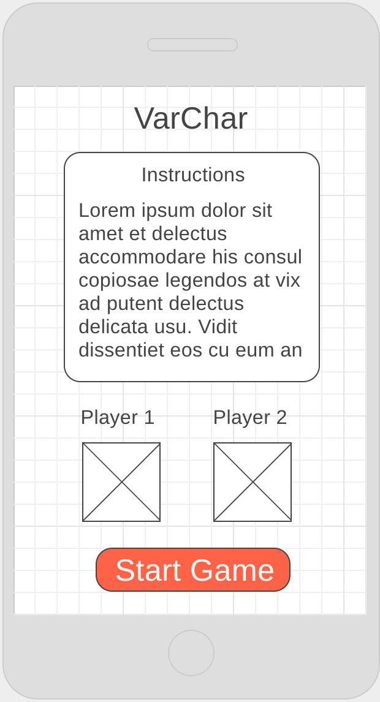
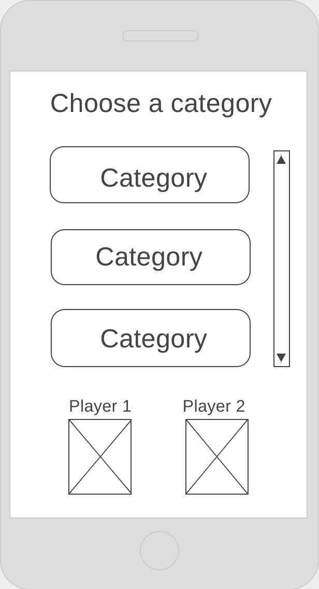
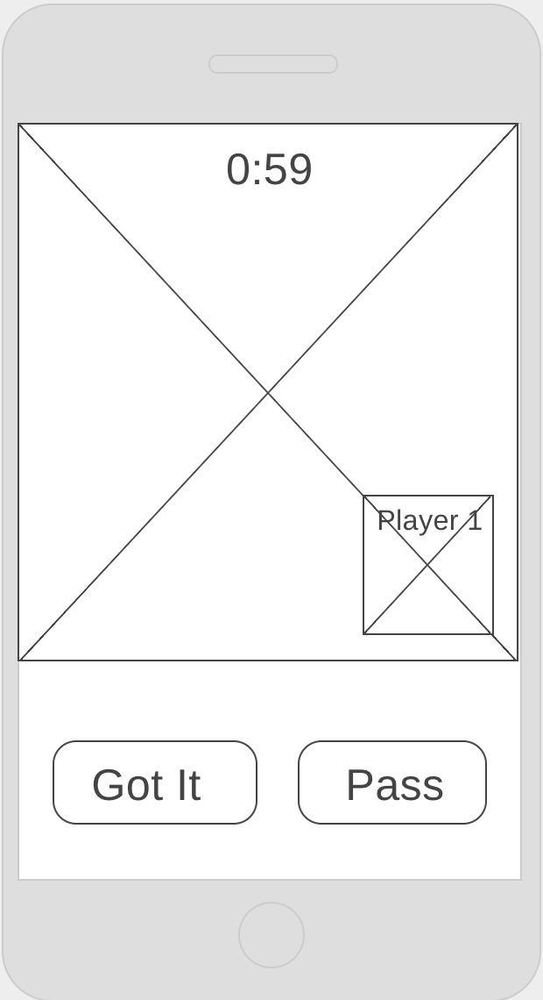
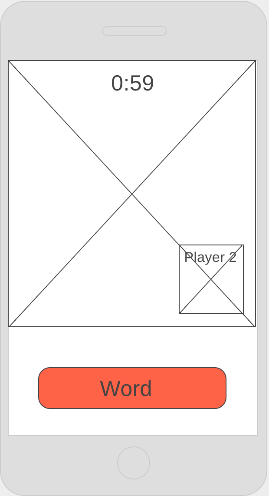
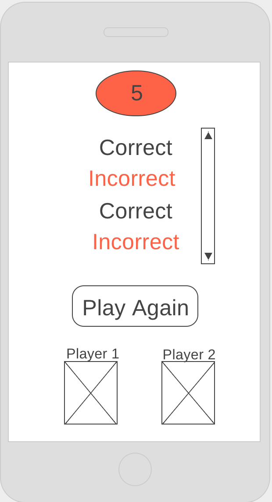

*** Lisa Louison / 6.12.17 ***

# VarChar Proposal

## What is VarChar?

Word guessing games are always a load of fun to play. Charades, Taboo, PictoWord and Heads Up are some popular ones that come to mind when family and friends are all in a room together. But, what if you aren't all in the same room? What if you aren't even in the same zip code?! That's where VarChar comes in.

VarChar is an interactive mobile video chat word-guessing game application. On the app, users are able to: 
- Log in and connect with a partner
- Choose a category of words
- One player gives hints over video of the word displayed 
- The other player has one minute to guess as many words as they can
- At the end of each round, the players can see how many words they got correct, they can switch roles, and play for as many rounds as they like

## Technologies To Be Used
- React Native - to simultaneously create a performant iOS and Android mobile application
- React Navigation - to handle routing between screens
- React Native Camera - to include video and audio camera features
- Expo - to reduce the code to simple javascript and then translate it to be built for both platforms and to publish the app
- Isomorphic fetch - to include a third party word association API
- Node & Express - to create a database
- SQL/ PG-Promise - to interact with the database
- Socket.io - to include real-time bidirectional video/audio

## Wireframes

#### Home Page

#### Category List

#### Guesser View

#### Giver View

#### End of Round View

## Initial thoughts on database structure

Category.

| id | category     |
|----| ------------:|
| 1  | 'Vacation'   |
| 2  | 'Animals'    |
| 3  | 'Game'       |

Word.

| id | word        | category_ref_id  |
|--- |:-----------:|-----------------:|
| 1  | 'Beach'     | 1                |
| 2  | 'Tiger'     | 2                |
| 3  | 'Pac-Man'   | 3                |

## Advanced Features
- User auth/login

## Links and Resources

- https://facebook.github.io/react-native/
- https://github.com/vhpoet/react-native-styling-cheat-sheet
- https://github.com/react-native-training/react-native-fonts
- https://docs.expo.io/versions/v17.0.0/index.html
- https://reactnavigation.org/docs/intro/
- https://github.com/shama/letswritecode/tree/master/p2p-video-chat-webrtc
- https://www.twinword.com/api/
- https://github.com/react-native-training
- https://egghead.io/courses/react-native-fundamentals
- https://github.com/lwansbrough/react-native-camera